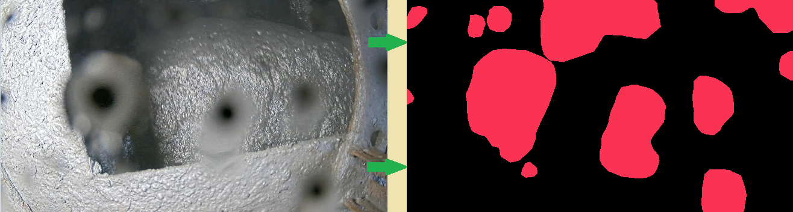

# [Хакатон Норникель 2024](https://nornickel-hackathon.ru/)

## Задача «Грязные дела»

### 1. Виды ухудшения качества кадра:
- загрязнение
- запотевание
- запыление
- повреждение твердыми частицами с ветром
- и многое другое

### 2. Метрика оценивания решений на лидерборде

IoU -  её код можно посмотреть в файле metric_iou.py

### 3. Некоторые возможные направления работы:   
   
a. Поиск и анализ существующих подходов  
  
- некоторые ключевые слова, которые могут помочь в поисках: Soiling detection / Camera contamination / Camera lens pollution
- https://developer.nvidia.com/blog/?p=13906  
- https://sh-tsang.medium.com/review-soilingnet-soiling-detection-on-automotive-surround-view-cameras-34a108b3506f (https://drive.google.com/drive/folders/1q51oyvx2_SFPts2XgSnKnaVc8ijZ6tKs)  
- https://arxiv.org/pdf/1905.01492 https://arxiv.org/pdf/2007.00801 https://github.com/valeoai/WoodScape?tab=readme-ov-file  
  
b. Работа с данными 
   
- улучшение существующей разметки   
- поиск открытых реальных данных для решения подобной задачи (Soiling Detection dataset https://drive.google.com/drive/folders/1q51oyvx2_SFPts2XgSnKnaVc8ijZ6tKs и другие)  
- сбор своих реальных данных в "полевых условиях" для решения задачи   
- скрап данных из интернета или из GPT -like для решения подобной задачи    
- поиск классических подходов для генерации синтетики (как raindrop, но другие)   
- поиск нейросетевых подходов    
для генерации синтетики (conditional GAN -like, pix2pix -like, подходы из https://habr.com/ru/companies/nornickel/articles/676296/ или более современные подходы)   
- другое?   
   
c. Работа с алгоритмом
    
- проверка классических эвристик   
- подбор архитектуры dl модели   
- аугментации/лоссы
- доп штрафы с кастомной логикой (как тут для пузырьков? https://habr.com/ru/companies/ods/articles/705020/)  
- какой- то претрейн на других данных или на себе? https://docs.lightly.ai/self-supervised-learning/getting_started/main_concepts.html   
- ансамбли подходов
- другое?

### 4. Q&A
